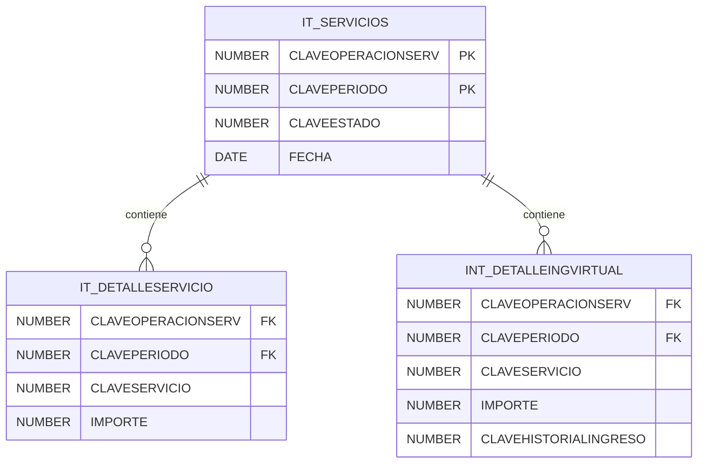

Arma una consulta para la siguiente tabla, donde pueda obtener los distinto recs por año para la claveobligacion 5, donde se da de baja en el campo fechafin cuando se asigna una fecha, esta púede ser nulo para estar activa , y que tome en cuenta las bajas del mismo año, si se pueden indicar de manera especifica las activas indefinidas y las que se dieron de alta y baja en el mismo año, puedes empezar con el año 2025.


CREATE TABLE SIR7_ING.RGA_OBLIGACION_CONT
(
  REC              VARCHAR2(20 BYTE),
  CLAVEOBLIGACION  NUMBER(2),
  FECHAINICIO      DATE,
  FECHAFIN         DATE
)





``` uml

  

note as TelosysDiagramTitleNote

Model <b>Db#1</b>

generated by <b>Telosys</b>

2026-05-06 ( 17:00:54 )

end note

  

class CatBasecalc {

+ idbasecalc : decimal {PK}

....

+ descripcion : string

....

+ listOfCatImpuestosEro : List<CatImpuestosEro>

+ listOfDeclaracion : List<Declaracion>

+ listOfDeclaracionCero : List<DeclaracionCero>

}

class CatDecCero {

+ idCatDecCero : decimal {PK}

....

+ descripcion : string

+ clavetipooperserv : decimal

....

+ listOfDeclaracionCero : List<DeclaracionCero>

}

class CatDeclaraciones {

+ idDec : decimal {PK}

....

+ descripcion : string

....

+ listOfIntBitacoraDec : List<IntBitacoraDec>

}

class CatEjercicio {

+ idejercicio : decimal {PK}

....

+ descripcion : string

....

+ listOfDeclaracion : List<Declaracion>

+ listOfIntDeclaracionislrs : List<IntDeclaracionislrs>

+ listOfDeclaracionCero : List<DeclaracionCero>

+ listOfDetDecompe : List<DetDecompe>

}

class CatEstadoDeclot {

+ idestadodec : decimal {PK}

....

+ descripcion : string

....

+ listOfIntDeclaracionislrs : List<IntDeclaracionislrs>

}

class CatEstadodec {

+ idestadodec : decimal {PK}

....

+ descripcion : string

+ observaciones : string

....

+ listOfDeclaracion : List<Declaracion>

}

class CatImpuestosEro {

+ idimpuesto : decimal {PK}

....

+ descripcion : string

+ conceptoimp : decimal

+ idtipoimp : decimal {FK}

+ idbasecalc : decimal {FK}

+ ejercicio : decimal

+ idTipImpEro : decimal {FK}

+ activonv : decimal

....

+ catTipoImpEro : CatTipoImpEro

+ catBasecalc : CatBasecalc

+ catTipoimp : CatTipoimp

+ listOfDetImpdecMes : List<DetImpdecMes>

+ listOfDetImpdec : List<DetImpdec>

+ listOfDetNumempdec : List<DetNumempdec>

}

class CatPeriodo {

+ idperiodo : decimal {PK}

....

+ descripcion : string

+ mesvigente : decimal

....

+ listOfDeclaracion : List<Declaracion>

+ listOfIntDeclaracionislrs : List<IntDeclaracionislrs>

+ listOfDetDecompe : List<DetDecompe>

+ listOfDeclaracionCero : List<DeclaracionCero>

}

class CatTipoImpEro {

+ idTipImpEro : decimal {PK}

....

+ descripcion : string

+ fechafin : timestamp

+ fechainicio : timestamp

....

+ listOfCatImpuestosEro : List<CatImpuestosEro>

}

class CatTipodec {

+ idtipodec : decimal {PK}

....

+ descripcion : string

....

+ listOfIntDeclaracionislrs : List<IntDeclaracionislrs>

+ listOfDeclaracionCero : List<DeclaracionCero>

+ listOfDeclaracion : List<Declaracion>

}

class CatTipoimp {

+ idtipoimp : decimal {PK}

....

+ descripcion : string

....

+ listOfCatImpuestosEro : List<CatImpuestosEro>

}

class Declaracion {

+ folio : decimal {PK}

....

+ totalpagar : decimal

+ fechaReg : timestamp

+ base : decimal

+ actualizacion : decimal

+ recargo : decimal

+ bonificacion : decimal

+ importecomp : decimal

+ rec : string

+ idperiodo : decimal {FK}

+ idejercicio : decimal {FK}

+ idbasecalc : decimal {FK}

+ numemp : decimal

+ idestadodec : decimal {FK}

+ m2 : decimal

+ imptocargo : decimal

+ imptoant : decimal

+ idtipodec : decimal {FK}

+ licencia : string

+ otrosestimulos : decimal

+ dfechaant : timestamp

+ totalafavor : decimal

+ creferencia : string

+ claveTiposubsidioEro : decimal {FK}

+ numempconsub : decimal

+ numempsinsub : decimal

+ basegravpropia : decimal

+ basegravretenida : decimal

+ impuestofavor : decimal

+ actualizacionfavor : decimal

+ recargofavor : decimal

+ idtipoenvio : decimal

+ folioPre : decimal

+ saldoafavor : decimal

+ decmanual : decimal

....

+ catPeriodo : CatPeriodo

+ catTipodec : CatTipodec

+ listOfIntVigenciaSub : List<IntVigenciaSub>

+ listOfIntDetalledeclaracionEro : List<IntDetalledeclaracionEro>

+ listOfCReplegal : List<CReplegal>

+ listOfIntSubsidioOe : List<IntSubsidioOe>

+ incTiposubsidioEro : IncTiposubsidioEro

+ listOfIntDeclaracionreglas : List<IntDeclaracionreglas>

+ catEjercicio : CatEjercicio

+ catEstadodec : CatEstadodec

+ catBasecalc : CatBasecalc

+ listOfIntSubsidioNp : List<IntSubsidioNp>

+ listOfIntAnualajuste : List<IntAnualajuste>

+ listOfDetImpdecMes : List<DetImpdecMes>

+ listOfIntDetallesucero : List<IntDetallesucero>

+ listOfDetNumempdec : List<DetNumempdec>

+ listOfIntSubsidioAh1n1 : List<IntSubsidioAh1n1>

+ listOfDetPagossucu : List<DetPagossucu>

+ listOfDetRetencion : List<DetRetencion>

+ listOfDetDecompe : List<DetDecompe>

+ listOfIntDetallesubsidioLiem : List<IntDetallesubsidioLiem>

+ listOfDetImpdec : List<DetImpdec>

+ listOfIntCausaEro : List<IntCausaEro>

}

class DeclaracionCero {

+ folio : decimal {PK}

....

+ rec : string

+ fechaReg : timestamp

+ idperiodo : decimal {FK}

+ idejercicio : decimal {FK}

+ idCatDecCero : decimal {FK}

+ motivo : string

+ creferencia : string

+ idtipodec : decimal {FK}

+ idbasecalc : decimal {FK}

....

+ catDecCero : CatDecCero

+ catBasecalc : CatBasecalc

+ catTipodec : CatTipodec

+ catPeriodo : CatPeriodo

+ catEjercicio : CatEjercicio

}

  

CatBasecalc::listOfCatImpuestosEro --> "N" CatImpuestosEro

CatBasecalc::listOfDeclaracion --> "N" Declaracion

CatBasecalc::listOfDeclaracionCero --> "N" DeclaracionCero

CatDecCero::listOfDeclaracionCero --> "N" DeclaracionCero

CatDeclaraciones::listOfIntBitacoraDec --> "N" IntBitacoraDec

CatEjercicio::listOfDeclaracion --> "N" Declaracion

CatEjercicio::listOfIntDeclaracionislrs --> "N" IntDeclaracionislrs

CatEjercicio::listOfDeclaracionCero --> "N" DeclaracionCero

CatEjercicio::listOfDetDecompe --> "N" DetDecompe

CatEstadoDeclot::listOfIntDeclaracionislrs --> "N" IntDeclaracionislrs

CatEstadodec::listOfDeclaracion --> "N" Declaracion

CatImpuestosEro::catTipoImpEro --> "1" CatTipoImpEro

CatImpuestosEro::catBasecalc --> "1" CatBasecalc

CatImpuestosEro::catTipoimp --> "1" CatTipoimp

CatImpuestosEro::listOfDetImpdecMes --> "N" DetImpdecMes

CatImpuestosEro::listOfDetImpdec --> "N" DetImpdec

CatImpuestosEro::listOfDetNumempdec --> "N" DetNumempdec

CatPeriodo::listOfDeclaracion --> "N" Declaracion

CatPeriodo::listOfIntDeclaracionislrs --> "N" IntDeclaracionislrs

CatPeriodo::listOfDetDecompe --> "N" DetDecompe

CatPeriodo::listOfDeclaracionCero --> "N" DeclaracionCero

CatTipoImpEro::listOfCatImpuestosEro --> "N" CatImpuestosEro

CatTipodec::listOfIntDeclaracionislrs --> "N" IntDeclaracionislrs

CatTipodec::listOfDeclaracionCero --> "N" DeclaracionCero

CatTipodec::listOfDeclaracion --> "N" Declaracion

CatTipoimp::listOfCatImpuestosEro --> "N" CatImpuestosEro

Declaracion::catPeriodo --> "1" CatPeriodo

Declaracion::catTipodec --> "1" CatTipodec

Declaracion::listOfIntVigenciaSub --> "N" IntVigenciaSub

Declaracion::listOfIntDetalledeclaracionEro --> "N" IntDetalledeclaracionEro

Declaracion::listOfCReplegal --> "N" CReplegal

Declaracion::listOfIntSubsidioOe --> "N" IntSubsidioOe

Declaracion::incTiposubsidioEro --> "1" IncTiposubsidioEro

Declaracion::listOfIntDeclaracionreglas --> "N" IntDeclaracionreglas

Declaracion::catEjercicio --> "1" CatEjercicio

Declaracion::catEstadodec --> "1" CatEstadodec

Declaracion::catBasecalc --> "1" CatBasecalc

Declaracion::listOfIntSubsidioNp --> "N" IntSubsidioNp

Declaracion::listOfIntAnualajuste --> "N" IntAnualajuste

Declaracion::listOfDetImpdecMes --> "N" DetImpdecMes

Declaracion::listOfIntDetallesucero --> "N" IntDetallesucero

Declaracion::listOfDetNumempdec --> "N" DetNumempdec

Declaracion::listOfIntSubsidioAh1n1 --> "N" IntSubsidioAh1n1

Declaracion::listOfDetPagossucu --> "N" DetPagossucu

Declaracion::listOfDetRetencion --> "N" DetRetencion

Declaracion::listOfDetDecompe --> "N" DetDecompe

Declaracion::listOfIntDetallesubsidioLiem --> "N" IntDetallesubsidioLiem

Declaracion::listOfDetImpdec --> "N" DetImpdec

Declaracion::listOfIntCausaEro --> "N" IntCausaEro

DeclaracionCero::catDecCero --> "1" CatDecCero

DeclaracionCero::catBasecalc --> "1" CatBasecalc

DeclaracionCero::catTipodec --> "1" CatTipodec

DeclaracionCero::catPeriodo --> "1" CatPeriodo

DeclaracionCero::catEjercicio --> "1" CatEjercicio

  

@enduml
```