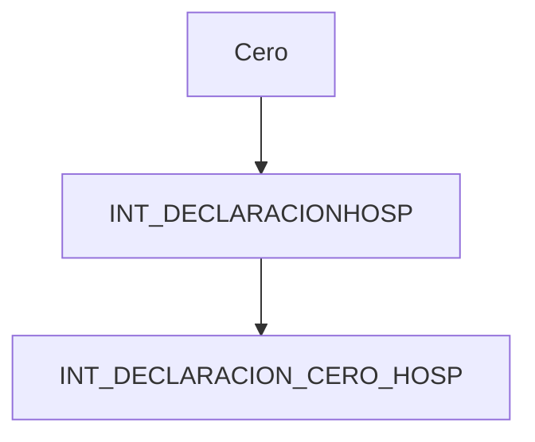

## Declaración mensual

```sql
sql = " Insert into INT_DECLARACIONHOSP(";  
sql += "FOLIO,";  
sql += "FECHA_REG,";  
sql += "BASE,";  
sql += "IMPTOCARGO,";  
sql += "TOTALPAGAR,";  
sql += "ACTUALIZACION,";  
sql += "RECARGO,";  
sql += "IMPORTECOMP,";  
sql += "REC,";  
sql += "IDPERIODO,";  
sql += "IDEJERCICIO,";  
sql += "NUMCUARTOS,";  
sql += "IDESTADODEC,";  
sql += "IMPTOANT,";  
sql += "IDTIPODEC,";  
sql += "DFECHAANT,";  
sql += "TOTALAFAVOR,";  
sql += "REFERENCIA) ";  
sql += " values(?,SYSDATE,?,?,?,?,?,?,?,?,?,0,?,?,?,";  
if ((hosp.decimpComple > 0) && !((hosp.decfechaComple.equals("--/--/----")))) {  
    sql += "to_date('" + hosp.decfechaComple + "', 'dd-mm-yyyy'), ?, ?)";  
} else {  
    sql += "null, ?, ?)";  
}
```

## Declaración cero


```sql
sql = "INSERT INTO INT_DECLARACION_CERO_HOSP ("  
        + " FOLIO, REC, FECHA_REG, IDPERIODO, IDEJERCICIO, ID_INC_DEC_CERO, MOTIVO, IDTIPODEC)"  
        + " VALUES(?,?,SYSDATE,?,?,?,?,?)";
```


Cabe aclarar que la declaracion en cero tambien se graba en la tabla mensual, la fk es el folio




